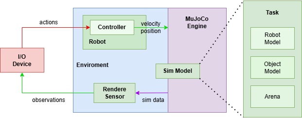

# Проект: manipulator-teleoperation
Проект реализует систему телеоперации робота UR5e в симуляторе MuJoCo с использованием джойстика для управления.
[](https://en.itmo.ru/en/)

**Технологии:** Python, MuJoCo, glfw, NumPy, matplotlib
## Алгоритм работы
Для лучшего понимания работы проекта, ниже представлен общий алгоритм функционирования системы телеперемещения роботизированного манипулятора. Этот алгоритм объясняет взаимодействие между компонентами системы


## Структура проекта
```bash
manipulator-teleoperation/
├── models/                   # Модели MuJoCo
│   ├── arm_assets/
│   │   ├── robotiq_2f85/
│   │   └── universal_robots_ur5e/
│   ├── my_arm.xml
│   ├── PickAndPlace.xml
│   └── scene.xml
├── src/                     # Исходный код проекта
│   ├── tests/
│   │   ├── test_joystick.py # Основной скрипт для управления с использованием джойстика
│   ├── callbacks.py         # Обрабатывает события мыши, клавиатуры и джойстика
│   ├── kinematics.py        # Расчёт прямой кинематики 6-звенного манипулятора
│   ├── overlay.py           # Управляет отображением информации на экране
│   ├── robot.py             # Определяет класс робота и его функциональность
│   ├── teleop_demo.py       # Главный скрипт демонстрации функциональности
│   └── utils.py             # Вспомогательные функции для проекта
├── .gitignore
├── icon.jpg                 # Иконка приложения
├── requirements.txt         # Зависимости для pip
├── robot_programming_env.yaml # Conda-окружение
└── README.md                # Документация проекта
```
## Запуск проекта

### Вариант 1: Использование requirements.txt

```bash
# Создание виртуального окружения
python -m venv venv

# Активация окружения
source venv/bin/activate  # Linux/macOS
venv\Scripts\activate     # Windows

# Установка зависимостей
pip install -r requirements.txt

# Запуск программы
python src/teleop_demo.py
```

### Вариант 2: Использование conda-окружения

```bash
# Создание окружения из YAML-файла
conda env create -f robot_programming_env.yaml

# Активация окружения
conda activate robot_programming

# Запуск программы
python src/teleop_demo.py
```
## Управление

### Джойстик
- **Левый стик**: Перемещение в плоскости X/Y
- **Правый стик**: Вращение инструмента
- **Триггеры L2/R2**: Перемещение по оси Z
- **Кнопка A**: Управление захватом
- **Кнопка B**: Выход из программы

### Клавиатура
- **Q**: Выход
- **C**: Переключение режима камеры
- **R**: Сброс симуляции
- **Мышь**: 
  - ЛКМ + движение: вращение камеры
  - ПКМ + движение: перемещение камеры
  - Колёсико: масштабирование

